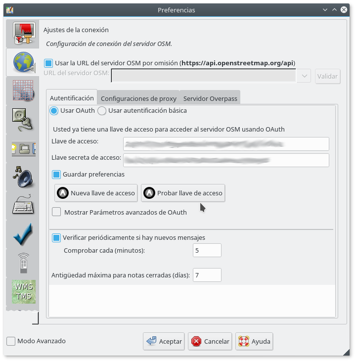
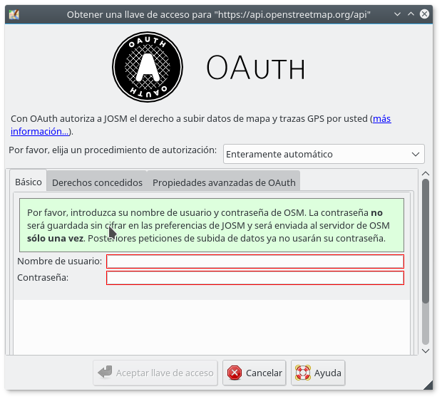

# Vincular nuestra cuenta de OSM con el editor JOSM

Cualquier tipo de edición en OSM está asociada a un usuario, o lo que es lo mismo: a diferencia de lo que ocurre en Wikipedia, en OSM no se permiten hacer modificaciones anónimas. Por tanto, si queremos utilizar JOSM deberemos enlazar el editor con nuestra cuenta de usuario, de modo que todos los cambios que hagamos queden vinculados a nuestro usuario. Existen dos maneras de hacer, mediante [OAuth](http://es.wikipedia.org/oauth) (más segura) o mediante identificación básica.

A continuación explicamos los dos modos posibles, y asumimos que nuestro ordenador tiene conexión a Internet.

## Vinculación utilizando OAuth
Utilizar el protocolo OAUTH es más recomendable porque en ningún momento se guarda información con nuestras credenciales de usuario en el equipo. De este modo, aunque alguien pudiera acceder al mismo, jamás podría apropiarse de nuestra cuenta de OSM.

Para utilizar OAUTH deberemos realizar los pasos siguientes:

1. Abir JOSM
2. Abrir la ventana de preferencias, ya sea:
3. Haciendo clic en el icono preferencias
4. Pulsando F12
5. Menú `Edición\Preferencias`
6. En la ventana preferencias haremos clic en la segunda pestaña, llamada "Configuración de conexión al Servidor OSM" (ver captura de pantalla a continuación) 
7. Haremos clic en el botón "Nueva llave de acceso" 
8. Introduciremos nuestro nombre de usuario y contraseña en las casillas correspondientes
9. Pulsar en el botón "Aceptar llave de acceso"
10. Si todo ha ido bien (importante, debemos de tener conexión a Internet)
 
## Vinculación Básica
Podemos vincular nuestra cuenta sin utilizar OAuth, símplemente introduciendo nuestras credenciales de usuario. Aunque este método es más rápido, tiene cierto grado de vulnerabilidad, dado que almacena nuestro nombre de usuario y contraseña en nuestro equipo, y cualquiera que accediese a él de manera no autorizada podría hacerse con nuestros datos de acceso.

Para utilizar este sistema deberemos realizar los pasos siguientes:

1. Abir JOSM
2. Abrir la ventana de preferencias, ya sea:
3. Haciendo clic en el icono preferencias
4. Pulsando F12
5. Menú `Edición\Preferencias`
6. En la ventana preferencias haremos clic en la segunda pestaña, llamada "Configuración de conexión al Servidor OSM" 
7. Haremos clic en el botón de selección `Usar autentificación básica` (ver captura de pantalla):
  
8. Introduciremos nuestras credenciales de acceso a OSM (nombre de usuario y contraseña) en las casillas correspondientes
9. Pulsar en el botón "Aceptar"